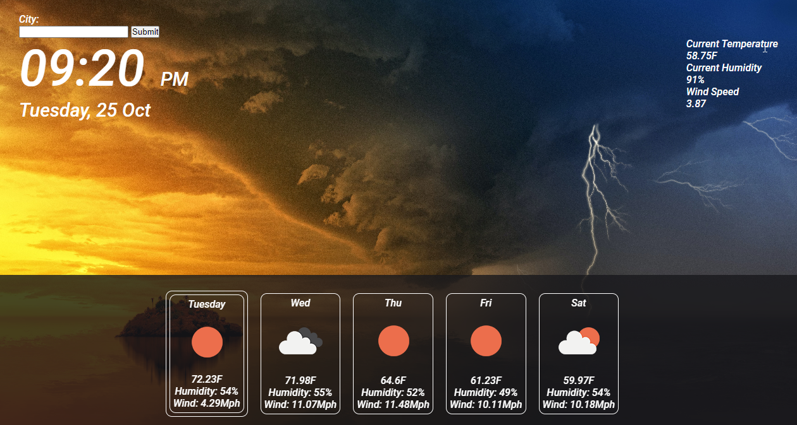

# Weather_Forecaster

## Purpose of this challenge

The reason for this challenge was to become more familiar with using server side API's. Also we learned how to use parameters to get more specific data, and in so we got more experience reading and working with API documentaion. This application is not finished, and I plan on revisiting it when I am more comfortable with data manipulation. Currently the application will give you your local weather conditions, along with a five day forecast. I still need to implement the search bar feature using the geolocation api fetch. 

## Image of webpage
 

## Deployment link

